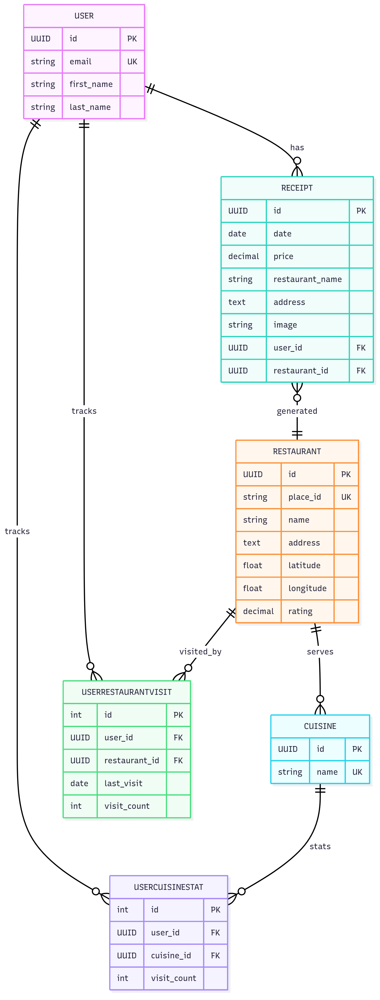

# LunchLog API

Office Lunch Receipt Management and Recommendation System - REST API Backend

## Table of Contents

- [Overview](#overview)
- [Project Structure](#project-structure)
- [Prerequisites](#prerequisites)
- [Quick Start](#quick-start)
- [Features](#features)
- [Tech Stack](#tech-stack)
- [Project Architecture](#project-architecture)
- [Data Schemas](#data-schemas)
- [API Endpoints](#api-endpoints)
  - [API Documentation (Swagger)](#api-documentation-swagger)
  - [Authentication](#authentication)
  - [Receipts](#receipts)
  - [Restaurants](#restaurants)
  - [Recommendation System](#recommendation-system)
- [Running the Project (Docker-first)](#running-the-project-docker-first)
  - [For Development](#for-development)
  - [For Production](#for-production)
  - [Available Profiles](#available-profiles)
  - [Manual Setup (Non-Docker)](#manual-setup-non-docker)
- [Available Commands](#available-commands)
- [Makefile Quick Reference](#makefile-quick-reference)
- [Environment Variables](#environment-variables)
- [Development](#development)
  - [Running Tests](#running-tests)
  - [Code Quality](#code-quality)
  - [Database Management](#database-management)
- [Testing](#testing)
- [Celery and Background Jobs](#celery-and-background-jobs)
- [Major Decisions](#major-decisions)
- [Future Improvements](#future-improvements)

## Overview

LunchLog is a Django REST API to manage lunch receipts and recommend restaurants. Users can upload receipt images, link them to restaurants, and browse a curated database. Background jobs enrich restaurant data (e.g., via Google Places). Media files are stored locally in development and can be stored on AWS S3 in production.

## Project Structure

```
lunchlog/
├── apps/                  # Django applications
│   ├── users/             # User management
│   ├── receipts/          # Receipt management
│   └── restaurants/       # Restaurant database
├── lunchlog/              # Django project settings
│   ├── settings/          # Environment-specific settings
│   ├── authentication.py  # Custom auth classes
│   └── permissions.py     # Custom permissions
├── tests/                 # Project-wide tests
├── docker-compose.yml     # Container configuration
└── Makefile               # Development commands
```
## Prerequisites
- Docker and Docker Compose version 2.24.0+
- Poetry (optional, but recommended)
- Python 3.11+ (optional, to make local changes)
- Install make

## Quick Start

1. Initialize environment: `make env` then edit `.env`, even if you don't edit the `.env` file everything will work.
2. Start services: `make docker-setup PROFILE=dev`
4. Run tests: `make test-coverage`
5. API running at `http://localhost:9000/api/v1/`

## Features

- **REST API Backend**: Complete API for lunch receipt management
- **Receipt Management**: Upload, categorize, and track lunch receipts
- **Restaurant Database**: Maintain a database of preferred restaurants
- **Authentication**: Session and token-based authentication
- **Webhook Support**: Token-based authentication for external integrations

## Tech Stack

- **Backend**: Django 4.2+ with Django REST Framework
- **Database**: PostgreSQL
- **API Documentation**: Swagger UI & ReDoc (via drf-yasg)
- **Testing**: pytest with coverage reporting
- **Code Quality**: black, isort, flake8
- **Containerization**: Docker Compose with profile-based deployments

## Project Architecture

Infrastructure Diagram:


- **Apps**: `users`, `receipts`, `restaurants`
- **API**: Django REST Framework routers under `/api/v1/`
- **Auth**: Session auth, DRF Token, and JWT (Simple JWT)
- **Background jobs**: Celery worker + Celery Beat with Redis broker
- **Database**: PostgreSQL
- **Storage**: Local filesystem in dev; AWS S3 (via `django-storages`) if S3 env vars are set
- **External API**: Google Places for restaurant enrichment (optional)

Data flow highlights:
- Receipt uploads store images under a user/date-based path. If S3 is configured, files go to your bucket.
- If a receipt has only `restaurant_name` and `address`, a background task attempts to enrich the linked `Restaurant` via Google Places.

## Data Schemas

ER diagram:

<p align="center">
  
</p>

## Running the Project (Docker-first)

### For Development:
1. Initialize environment: `make env` then edit `.env`, even if you don't edit the `.env` file everything will work.
2. Start services: `make docker-setup`
3. Create admin user: `make createsuperuser-docker`
4. API running at `http://localhost:9000/api/v1/`

### For Production: 
1. You need to make sure to create the necessary SSL certificates and put them in the `deploy/certs` directory.
2. Run`make docker-setup PROFILE=prod` in step 2 above, and extra proxy container will be started to route to the production API.
3. API running at `https://localhost/api/v1/`

### Available Profiles

The system supports different deployment profiles:

- **dev**: Development mode
  ```bash
  make docker-setup PROFILE=dev
  ```
- **prod**: Production mode 
  ```bash
  make docker-setup PROFILE=prod
  ```

You can also set the profile for your entire session:
```bash
export PROFILE=dev
make docker-setup
make logs
make down
```

### Manual Setup (Non-Docker)

If you prefer manual setup:

```bash
# Install dependencies
pip install -r requirements.txt
# OR with Poetry
poetry install

# Run migrations
make migrate

# Create superuser
make createsuperuser

# Start development server
make runserver
```

## Available Commands

Run `make help` to see all available commands:

```bash
make help           # Show help (displays current profile)
make docker-setup   # Complete development setup in Docker
make up             # Start containers
make down           # Stop containers
make migrate        # Run migrations
make test           # Run tests
make test-coverage  # Run tests with coverage report
make lint           # Run linting
make format         # Format code
...
```

## API Endpoints

### API Versioning Strategy

All endpoints are prefixed with `/api/v1/` for the following reasons:

- **Backward Compatibility**: Version prefix allows us to evolve the API without breaking existing clients. New fields or endpoint changes can be introduced in a new version while maintaining v1 contracts.

- **Parallel Versions**: It can run multiple versions simultaneously (e.g., `/api/v1/` and `/api/v2/`), enabling gradual client migrations and smooth transitions.

- **Clear Contracts**: Each version has its own OpenAPI/Swagger documentation, test suite, and validation rules, making it clear what clients can expect.

- **Safe Deprecation**: Older versions can be deprecated on a clear timeline while keeping newer versions active, giving clients time to migrate.

### API Documentation (Swagger)

Interactive API documentation is available via Swagger UI and ReDoc:


- **Swagger UI**: `http://localhost:9000/swagger/` (development) or `https://localhost/swagger/` (production)

The documentation includes:
- Interactive API explorer with "Try it out" functionality
- Remember to create a jwt token to use the api and put it in the "Authorization" header by clicking on the "Authorize" button. Don't forget to put the "Bearer " prefix in front of the token.
- You can use the default user "user@example.com" with password "changeme123" to test the api.
- Complete schema definitions for all models
- Authentication examples for all three auth methods
- Detailed documentation for the recommendation system endpoints

### Authentication

- Session auth
  - `POST /api/v1/auth/signup/` - Create user and start session
  - `POST /api/v1/auth/login/` - Login and start session
- Token auth
  - `POST /api/v1/auth/token/` - Obtain DRF token
- JWT auth (Simple JWT)
  - `POST /api/v1/auth/jwt/create/`
  - `POST /api/v1/auth/jwt/refresh/`
  - `POST /api/v1/auth/jwt/verify/`

Examples:

```bash
# Create a user (session auth)
curl -X POST http://localhost:9000/api/v1/auth/signup/ \
  -H "Content-Type: application/json" \
  -d '{"email": "user@example.com", "password": "changeme123"}'

# Login (session auth)
curl -X POST http://localhost:9000/api/v1/auth/login/ \
  -H "Content-Type: application/json" \
  -d '{"email": "user@example.com", "password": "changeme123"}'

# Obtain DRF token
curl -X POST http://localhost:9000/api/v1/auth/token/ \
  -H "Content-Type: application/json" \
  -d '{"username": "user@example.com", "password": "changeme123"}'

# Create JWT
curl -X POST http://localhost:9000/api/v1/auth/jwt/create/ \
  -H "Content-Type: application/json" \
  -d '{"email": "user@example.com", "password": "changeme123"}'
```

### Receipts

- `GET /api/v1/receipts/` - List receipts
- `POST /api/v1/receipts/` - Create receipt (multipart)
- `GET /api/v1/receipts/{id}/` - Get receipt detail
- `PUT /api/v1/receipts/{id}/` - Update receipt
- `DELETE /api/v1/receipts/{id}/` - Delete receipt

Examples:

```bash
# List (Token auth)
curl -X GET http://localhost:9000/api/v1/receipts/ \
  -H "Authorization: Bearer $ACCESS"

# Create (multipart). Provide restaurant_id OR restaurant_name + address
curl -X POST http://localhost:9000/api/v1/receipts/ \
  -H "Authorization: Bearer $ACCESS" \
  -F "date=2025-09-19" \
  -F "price=12.50" \
  -F "restaurant_id=2c3c5fbc-2a5a-4b7f-8d52-6a3e9b5c9b02" \
  -F "image=@/absolute/path/to/receipt.jpg"

# OR name/address instead of restaurant_id
curl -X POST http://localhost:9000/api/v1/receipts/ \
  -H "Authorization: Bearer $ACCESS" \
  -F "date=2025-09-19" \
  -F "price=12.50" \
  -F "restaurant_name=Pasta Place" \
  -F "address=123 Main St, City" \
  -F "image=@/absolute/path/to/receipt.jpg"
```

### Restaurants

- `GET /api/v1/restaurants/` - List restaurants
- `POST /api/v1/restaurants/` - Create restaurant
- `GET /api/v1/restaurants/{id}/` - Get restaurant detail
- `PUT /api/v1/restaurants/{id}/` - Update restaurant
- `DELETE /api/v1/restaurants/{id}/` - Delete restaurant

Examples:

```bash
# List (JWT)
ACCESS=$(curl -s -X POST http://localhost:9000/api/v1/auth/jwt/create/ \
  -H "Content-Type: application/json" \
  -d '{"email": "user@example.com", "password": "changeme123"}' | jq -r .access)

curl -H "Authorization: Bearer $ACCESS" http://localhost:9000/api/v1/restaurants/

# Create
curl -X POST http://localhost:9000/api/v1/restaurants/ \
  -H "Authorization: Bearer $ACCESS" \
  -H "Content-Type: application/json" \
  -d '{
        "name": "Pasta Place",
        "address": "123 Main St, City",
        "latitude": 40.7128,
        "longitude": -74.006,
        "cuisine_names": ["Italian"]
      }'
```

### Recommendation System

- `GET /api/v1/restaurants/recommendations/good/` - Highly rated restaurant recommendations
- `GET /api/v1/restaurants/recommendations/cheap/` - Budget-friendly restaurant recommendations  
- `GET /api/v1/restaurants/recommendations/cuisine-match/` - Restaurants matching user's preferred cuisines
- `GET /api/v1/restaurants/recommendations/all/` - All recommendation types in a single response

#### Why Separate Endpoints?

Instead of using a single endpoint with a `type` parameter, separate endpoints are used for these reasons:

- **Flexible Parameters**: Different endpoints can have type-specific parameters without cluttering a single endpoint. For example, `cuisine-match` might need cuisine filtering while `cheap` focuses on price ranges.

- **Independent Caching**: Each endpoint can have its own cache TTL and invalidation rules. High-quality recommendations might cache longer than real-time price-based ones.

- **Permission Granularity**: Future access control can be applied per recommendation type, premium users can get different types of recommendations.

#### Query Parameters

All recommendation endpoints support these optional parameters:
- `limit` - Number of recommendations to return (default: 20 for individual types, 10 for all)
- `radius` - Search radius in meters around frequent locations (default: 2000)
- `search_limit` - Max results per location search (default: 20)

#### Examples

```bash
# Get good restaurant recommendations
curl -H "Authorization: Bearer $ACCESS" \
  "http://localhost:9000/api/v1/restaurants/recommendations/good/?limit=10&radius=1500"

# Get budget-friendly recommendations
curl -H "Authorization: Bearer $ACCESS" \
  "http://localhost:9000/api/v1/restaurants/recommendations/cheap/?limit=15"

# Get cuisine-matched recommendations
curl -H "Authorization: Bearer $ACCESS" \
  "http://localhost:9000/api/v1/restaurants/recommendations/cuisine-match/"

# Get all recommendation types
curl -H "Authorization: Bearer $ACCESS" \
  "http://localhost:9000/api/v1/restaurants/recommendations/all/?limit=5"
```

#### Response Format

Each recommendation includes:
- Restaurant details (name, address, rating, etc.)
- Recommendation type and reason
- User context (frequent restaurants, preferred cuisines)
- Google Places enrichment data when available

Example response:
```json
{
  "recommendation_type": "good",
  "count": 5,
  "recommendations": [
    {
      "place_id": "ChIJ...",
      "name": "Amazing Bistro",
      "rating": 4.8,
      "price_level": 2,
      "vicinity": "123 Food St, City",
      "cuisines": ["French", "European"],
      "recommendation_type": "good",
      "business_status": "OPERATIONAL"
    }
  ],
  "user_context": {
    "frequent_restaurants": [
      {"name": "Regular Spot", "visit_count": 15}
    ],
    "preferred_cuisines": [
      {"name": "Italian", "visit_count": 8}
    ]
  }
}
```

## Development

### Running Tests

```bash
make test              # Run all tests
make test-coverage     # Run with coverage report
```

### Code Quality

```bash
make lint              # Check code quality
make format            # Format code
make format-check      # Check formatting
```

### Database Management

```bash
make migrate           # Run migrations
make makemigrations    # Create new migrations
make reset-db          # Reset database (WARNING: destroys data)
```

## Testing

This project uses pytest. To enable fast, isolated unit tests and broader integration tests, mock external systems by default, and provide an opt-in test that can hit real external APIs when needed.

A code coverage report is included in the tests, currently the tests only pass with at least 80% coverage, which is currently achieved.

### Test types

- Unit tests: Validate small, isolated logic (serializers, utilities, services). All I/O and externals are mocked.
- Integration tests: Exercise end-to-end flows across Django, DRF, PostgreSQL, and Celery. Celery runs in eager mode in tests so task results are asserted immediately.

### Mocking external systems

External dependencies (e.g., Google Places) are mocked to keep tests deterministic and fast. Celery enqueues are also mocked where necessary.

```python
from unittest import mock

with mock.patch("apps.restaurants.tasks.GooglePlacesService") as MockService:
    svc = MockService.return_value
    svc.find_place_from_text.return_value = {"candidates": [...]}
    svc.fetch_restaurant_details.return_value = {"result": {...}}

with mock.patch("apps.restaurants.tasks.update_restaurant_info.delay") as mock_task:
    resp = auth_client.post("/api/v1/receipts/", data, format="multipart")
    mock_task.assert_called_once()
```

### Live external test (opt‑in)

There is a single test marked `external` that can call the real Google Places API to verify end-to-end enrichment. It is skipped unless `GOOGLE_PLACES_API_KEY` is provided in the environment variables.

Run it explicitly (Docker):

```bash
# Start services (if not running)
make docker-setup
```

### Selective runs

```bash
# All tests (inside Docker)
make test

# Only integration tests
docker compose exec backend pytest -m integration -q

# Run only external tests
docker compose exec backend bash -lc \
  'export GOOGLE_PLACES_API_KEY=your-key && pytest -m external -q'

# Coverage
make test-coverage
```

## Celery and Background Jobs

Celery powers asynchronous and scheduled work for the API (e.g., enriching restaurant data from Google Places). The project runs a dedicated worker and a beat scheduler alongside the API and Redis.

### Components

- Worker: `celery -A lunchlog worker --loglevel=info` (service `celery`)
- Beat: `celery -A lunchlog beat --loglevel=info --scheduler django_celery_beat.schedulers:DatabaseScheduler` (service `celery-beat`)
- Broker & result backend: Redis (see `CELERY_BROKER_URL`, `CELERY_RESULT_BACKEND`)
- App config: `lunchlog/celery.py` with `app.autodiscover_tasks()`

### Source files and configuration

- Celery app: `lunchlog/celery.py`
- Celery settings: `lunchlog/settings/base.py` (prefixed with `CELERY_`)
- Tasks: `apps/restaurants/tasks.py`
- Periodic schedule seeding: `apps/restaurants/management/commands/setup_periodic_tasks.py`
- Services and commands: `docker-compose.yml` (services `celery` and `celery-beat`)

### Key tasks

- `apps.restaurants.tasks.update_restaurant_info(restaurant_id)`: Fetches details from Google Places for a given `Restaurant`, handles stub `place_id` resolution, updates fields atomically, and retries on failure with exponential backoff (`max_retries=3`). Returns a structured result payload on success/error.
- `apps.restaurants.tasks.update_all_restaurants()`: Bulk queues `update_restaurant_info` for every restaurant. Intended for periodic execution via beat.

### Scheduling (django-celery-beat)

A database scheduler is used and a management command seeds a periodic job:

```startLine:endLine:apps/restaurants/management/commands/setup_periodic_tasks.py
from django_celery_beat.models import PeriodicTask, CrontabSchedule
...
task, created = PeriodicTask.objects.get_or_create(
    name="Update all restaurants",
    defaults={
        "crontab": schedule,
        "task": "apps.restaurants.tasks.update_all_restaurants",
        ...,
    },
)
```

Apply or update schedules:

```bash
docker compose exec backend python manage.py migrate  # ensures beat tables
docker compose exec backend python manage.py setup_periodic_tasks
```

### Local development

Start everything:

```bash
make docker-setup
```

Tail worker and beat logs:

```bash
docker compose logs -f celery
docker compose logs -f celery-beat
```

Trigger tasks manually:

```bash
# Update one restaurant
docker compose exec backend python - <<'PY'
from apps.restaurants.tasks import update_restaurant_info
print(update_restaurant_info.delay("<restaurant-uuid>").id)
PY

# Queue bulk update
docker compose exec backend python - <<'PY'
from apps.restaurants.tasks import update_all_restaurants
print(update_all_restaurants.delay().id)
PY
```

### Why Celery?

- Reduce API latency: Offload slow, I/O-heavy work (third-party API calls, enrichment) from request/response paths, returning responses faster to users.
- Improve reliability: Built-in retries/backoff for transient failures instead of failing user requests.
- Smooth load on the API: Background queue absorbs spikes, keeping `backend` responsive and resource usage stable.
- Scale independently: Worker processes can be scaled horizontally without scaling the API.

## Makefile Quick Reference

```bash
make env                    # Initialize .env
make up PROFILE=dev         # Start db, backend, redis, celery, beat
make migrate-docker         # Run migrations in container
make createsuperuser-docker # Create admin user in container
make logs                   # Tail logs
make test                   # Run pytest in container
make down                   # Stop all containers (dev/prod)
```

## Major Decisions

- **Django + DRF**: Fast delivery of a robust, well-documented REST API with batteries included (auth, permissions, serializers, viewsets).
- **PostgreSQL**: Reliable relational database with strong JSON support and indexing.
- **Celery + Redis**: Offload long-running/enrichment tasks (e.g., Google Places lookups) without blocking API requests.
- **AWS S3 for media**: Durable, cost-effective media storage; swap seamlessly via `django-storages`.
- **Accumulative stats tables**: When aggregating analytics, maintain accumulative tables to avoid recomputation on every request. Updates are appended/incremental via scheduled Celery tasks for predictable latency.

## Future Improvements

- **OCR for receipts**: Extract vendor, date, total, and line items from uploaded images. This can run asynchronously via Celery to keep requests fast.
- **Cuisine classification**: Train a lightweight classifier to better infer cuisine descriptors from names/menus; Google Maps types are often sparse or missing.
