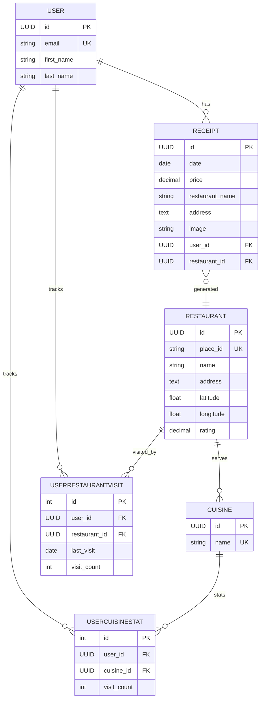
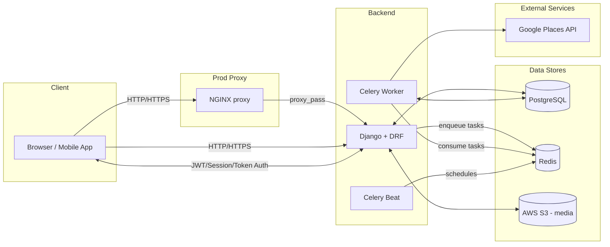

ER Diagram:

```mermaid
erDiagram
    USER {
        UUID id PK
        string email UK
        string first_name
        string last_name
    }
    RECEIPT {
        UUID id PK
        date date
        decimal price
        string restaurant_name
        text address
        string image
        UUID user_id FK
        UUID restaurant_id FK
    }
    RESTAURANT {
        UUID id PK
        string place_id UK
        string name
        text address
        float latitude
        float longitude
        decimal rating
    }
    CUISINE {
        UUID id PK
        string name UK
    }
    USERRESTAURANTVISIT {
        int id PK
        UUID user_id FK
        UUID restaurant_id FK
        date last_visit
        int visit_count
    }
    USERCUISINESTAT {
        int id PK
        UUID user_id FK
        UUID cuisine_id FK
        int visit_count
    }
    USER ||--o{ RECEIPT : has
    USER ||--o{ USERRESTAURANTVISIT : tracks
    USER ||--o{ USERCUISINESTAT : tracks
    RECEIPT }o--|| RESTAURANT : generated
    RESTAURANT ||--o{ USERRESTAURANTVISIT : visited_by
    RESTAURANT ||--o{ CUISINE : serves
    CUISINE ||--o{ USERCUISINESTAT : stats

```

Infrastructure Diagram:

```mermaid
    flowchart LR
    subgraph Client
        A[Browser / Mobile App]
    end

    subgraph Prod Proxy
        N[NGINX proxy]
    end

    subgraph Backend
        B[Django + DRF]
        C[Celery Worker]
        CB[Celery Beat]
    end

    subgraph Data Stores
        D[(PostgreSQL)]
        R[(Redis)]
        S3[(AWS S3 - media)]
    end

    subgraph External Services
        G[Google Places API]
    end

    A -- HTTP/HTTPS --> N
    N -- proxy_pass --> B

    A -- HTTP/HTTPS --> B

    B <-- JWT/Session/Token Auth --> A
    B <--> D
    B <--> S3
    B -- enqueue tasks --> R

    C -- consume tasks --> R
    C <--> D
    C --> G

    CB -- schedules --> R

    classDef store fill:#eef,stroke:#446;
    class D,R,S3 store;
```