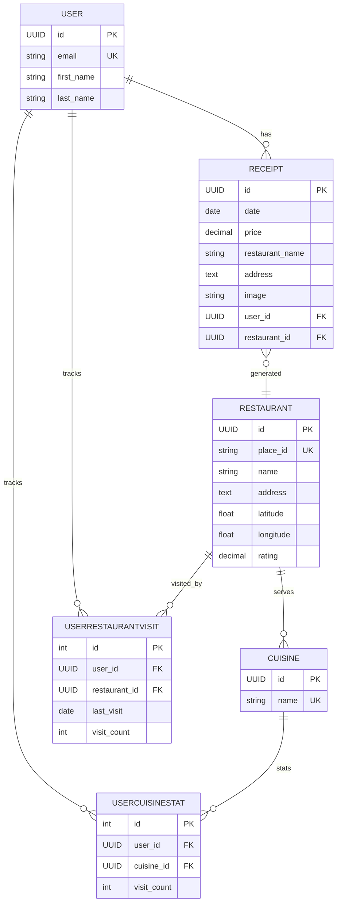
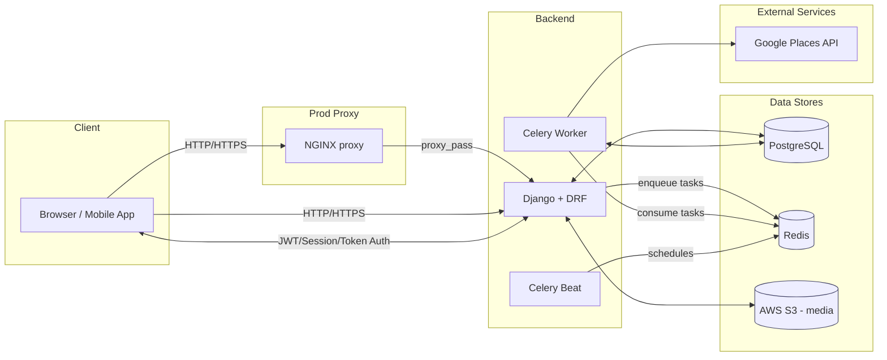

ER Diagram:


Infrastructure Diagram:



Deployment Diagram:

### Architecture (Mermaid)
The diagram reflects the current CloudFormation template (`deploy/cloudformation/ecs.yml`): no ALB, backend gets a public IP; RDS and Redis are in private subnets; secrets flow via Secrets Manager; logs to CloudWatch; assets in S3.

```mermaid
flowchart LR
  subgraph AWS["AWS Account"]
    subgraph VPC["VPC 10.0.0.0/16"]
      IGW[Internet Gateway]

      subgraph PublicSubnets["Public Subnets (10.0.1.0/24, 10.0.2.0/24)"]
        ECS[ECS Cluster]
        Backend["Backend Service (Fargate)\nport 8000\nSG: app-sg"]
        Celery["Celery Worker (Fargate)"]
        Beat["Celery Beat (Fargate)"]
      end

      subgraph PrivateSubnets["Private Subnets (10.0.11.0/24, 10.0.12.0/24)"]
        RDS[("RDS Postgres\nSG: rds-sg")]
        Redis[("ElastiCache Redis\nReplication Group\nSG: redis-sg")]
      end
    end

    S3Static[("S3 Bucket\nStatic (public read)")]
    S3Media[("S3 Bucket\nMedia (private)")]
    Secrets["Secrets Manager\n(SECRET_KEY, RDS password,\nDATABASE_URL, REDIS_URL)"]
    CWLogs["CloudWatch Logs\n/ecs/lunchlog/prod/*"]
    ECR[("ECR Repository\nApp Image")]
  end

  %% Networking and service placement
  IGW <-- public IP --> Backend
  ECS --> Backend
  ECS --> Celery
  ECS --> Beat

  %% App to data stores (same VPC, SG-restricted)
  Backend -->|5432| RDS
  Celery -->|5432| RDS
  Beat -->|5432| RDS

  Backend -->|6379| Redis
  Celery -->|6379| Redis
  Beat -->|6379| Redis

  %% Storage & logs
  Backend --> S3Static
  Backend --> S3Media
  Backend --> CWLogs
  Celery --> CWLogs
  Beat --> CWLogs

  %% Secrets flow into tasks via task role
  Secrets -. env/secret values .-> Backend
  Secrets -. env/secret values .-> Celery
  Secrets -. env/secret values .-> Beat

  %% Image source
  ECR --> Backend
  ECR --> Celery
  ECR --> Beat

  %% Styles / colors
  classDef svc fill:#E7F7ED,stroke:#2e7d32,stroke-width:1px;
  classDef datastore fill:#FFF3E0,stroke:#ef6c00,stroke-width:1px;
  classDef cache fill:#FCE4EC,stroke:#ad1457,stroke-width:1px;
  classDef bucket fill:#E3F2FD,stroke:#1565c0,stroke-width:1px;
  classDef secrets fill:#F3E5F5,stroke:#6a1b9a,stroke-width:1px;
  classDef logs fill:#FFFDE7,stroke:#f9a825,stroke-width:1px;
  classDef repo fill:#ECEFF1,stroke:#455a64,stroke-width:1px;
  classDef net fill:#F5F5F5,stroke:#9e9e9e,stroke-width:1px;

  class Backend, Celery, Beat, ECS svc
  class RDS datastore
  class Redis cache
  class S3Static, S3Media bucket
  class Secrets secrets
  class CWLogs logs
  class ECR repo
  class IGW net
```